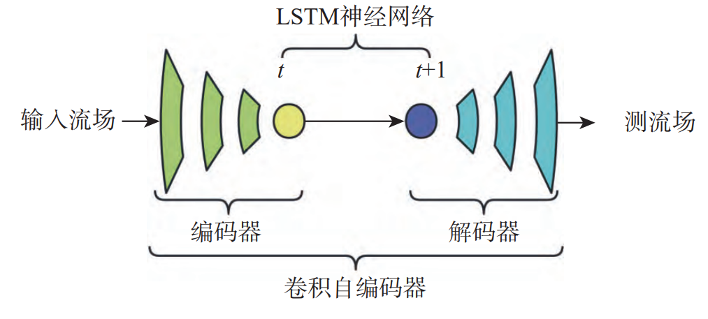

# AI框架和科学计算大作业

## 作业来源

| 题号 | 模型名称                     | 论文标题                                         | 描述                                                         | 论文下载链接                                                 | 算法链接                                                     | 领域     |
| ---- | ---------------------------- | ------------------------------------------------ | ------------------------------------------------------------ | ------------------------------------------------------------ | ------------------------------------------------------------ | -------- |
| B89  | CAE-LSTM方法求解二维黎曼问题 | 卷积自编码器在非定常可压缩流动降阶模型中的适用性 | 降阶模型可有效降低使用CFD方法的设计成本和周期。对于复杂的可压缩流动，使用POD等线性方法进行流场降维，需要大量的模态才能保证流场重建的精度，而采用非线性降维方法能够有效减少所需模态数。卷积自编码器(CAE)是一种由编码器和解码器组成的神经网络，能够实现数据降维和重构，可看作是POD方法的非线性拓展。采用CAE进行流场数据的非线性降维，同时使用LSTM进行流场状态的时间演化。对于非定常可压缩流动，“CAE-LSTM”降阶模型能够在使用较少自由变量数的前提下获得较高的重构和预测精度。 | https://kns.cnki.net/kcms2/article/abstract?v=smPsKIJgVaBABEVe4IgoVTm9JTFFBzlU_GhfzxvATPJpKk3QWiiyNN2R1zsdkiUwH5JStwO6v8t7HxOS7WrdBq6smdoQdFv-sRs5eAyUGSWiMO913gw18FpHfme1pZdK_QxkftSu2dzLe746DdAxXg==&uniplatform=NZKPT&language=CHS | https://gitee.com/mindspore/mindscience/tree/master/MindFlow/applications/research/cae_lstm | 科学智算 |

## 背景

在[流体力学](https://zhida.zhihu.com/search?content_id=167673106&content_type=Article&match_order=1&q=流体力学&zhida_source=entity)领域，**[降阶模型](https://zhida.zhihu.com/search?content_id=167673106&content_type=Article&match_order=1&q=降阶模型&zhida_source=entity)（Reduced-order model）**能够对原本无限维度中的流场动态提供一个紧凑且经济的低维描述。在有限的维度中研究流场的动态变化，使我们能从理论上系统地研究其非线性动力学，以理解其背后的物理机理；并能更加经济高效的进行探索性研究，以提供更具针对性的控制方法。

### 方法描述

CAE-LSTM

下图 为 CAE-LSTM 网络的结构。针对非定常 可压缩流动，采用 CAE 网络对流场进行降维，提取 流动数据的特征，将其压缩到编码器的隐藏空间中，再用 LSTM 神经网络对隐藏空间的自由变量进 行系数时间演化，得到流动其他时刻的自由变量， 再通过 CAE 网络的解码器将演化的自由变量进行 解码，重建得到相应时刻的流场流动数据。



## 仓库架构说明

`./cae_lstm`中存储代码

## 使用方法

首先，我们需要使用MindSpore，Ascend环境，安装[MindFlow](https://www.mindspore.cn/mindflow/docs/zh-CN/master/mindflow_install.html)以及其代码运行所需要使用的安装包，即运行以下命令行：

```
pip install -r requirements.txt
export DEVICE_NAME=gpu
pip install mindflow_${DEVICE_NAME}
```

之后按照`./cae_lstm/README.md`中的说明进行运行即可。

